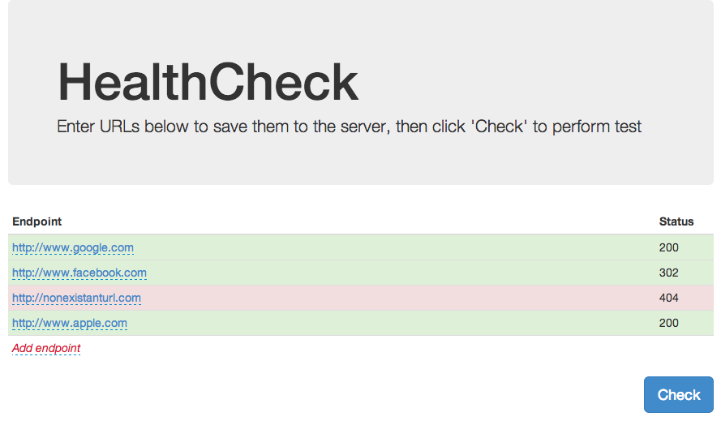

HealthCheck
===========

HealthCheck is a small utility for performing health checks of servers you maintain. Simply enter a set of URLs and run the test. The Node.js server will asynchronously check the HTTP response code of each URL and return it to you in an easy to understand interface.

This is the main page for viewing endpoints to test and the response codes from each

